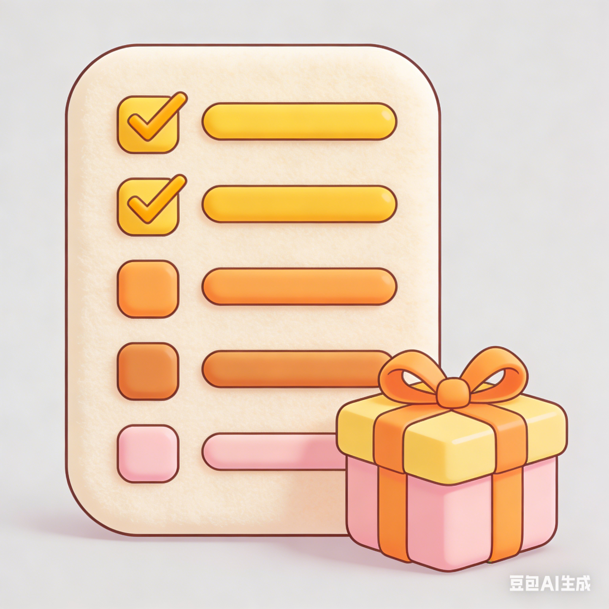

# 自勉RewardOneself
**《自勉》为勤奋的人设计，鼓励用户在完成既定目标后，适当地给予自己一些奖励**

## 核心亮点

- **任务管理**：用户可以列出自己的任务或目标
- **积分激励**：每完成一项任务，用户便可以在表格记录并获取相应的积分
- **奖励兑换**：一旦积累了足够的积分，用户就可以选择兑换之前设定好的奖励
- **优先级计算**：创新的优先级算法，基于数值运算，比传统四象限分类法更精确

## 优先级计算规则

每个任务的优先级是根据以下几个因素综合计算得出的：

- **重要性**：范围为0到5。其中，5表示非常重要（对应无穷大）
- **紧急度**：范围为1到3
- **价值**：范围为1到3
- **时间**：完成任务所需的时间，单位为分钟

#### 优先级的计算公式如下

**优先级 = 重要性 × 4  +  紧急度 × 2 + 价值 × 3  - 时间 ÷ 10**

特别地，如果任务被标记为“非常重要”，则其优先级为无穷大（即最高优先级）。